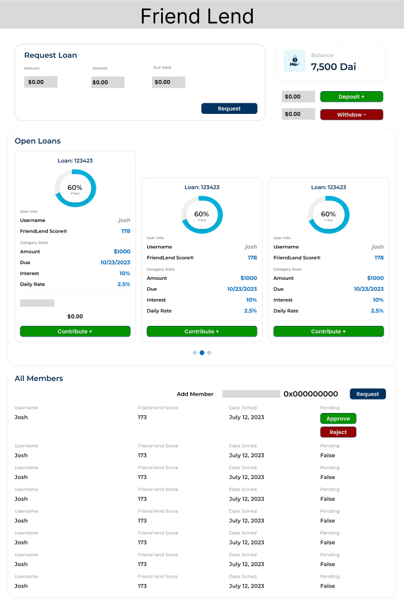
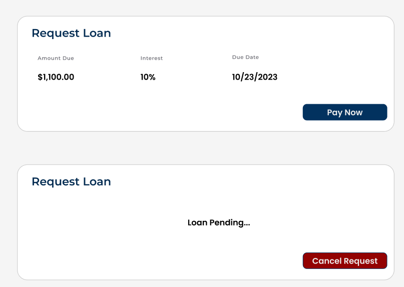

# defi-project

## Flow of Normal Logic Example

In this scenario, Josh, Dylan, and Joey are part of a lending group. The following steps demonstrate how a new member, Cyril, is invited, a loan is requested and funded, and the repayment and withdrawal processes occur.

### Step 1: Josh Proposes a New Invite for an ETH Address
- **Josh**: `proposeInvite(0x123456789ABCDEF...);`

### Step 2: Dylan and Josh Vote "Yes," Joey Votes "No"
- **Josh**: `voteOnPendingPerson(0x123456789ABCDEF..., true);`
- **Dylan**: `voteOnPendingPerson(0x123456789ABCDEF..., true);`
- **Joey**: `voteOnPendingPerson(0x123456789ABCDEF..., false);`

### Step 3: Cyril is Admitted to the Network By Majority
- **Cyril**: `join("Cyril");`

### Step 4: Josh & Dylan Each Transfer $800 into the Pool
- **Josh**: `depositFunds(value: 800);`
- **Dylan**: `depositFunds(value: 800);`

### Step 5: Cyril Requests a Loan for $1000 for Investing in BananaCoin
- **Cyril**: `requestLoan(1000, 10%, now + 1 week, "Invest in BananaCoin");`

### Step 6: Dylan Contributes $800 and Josh Contributes $200 to Fill the Loan Request
- **Dylan**: `fillLoanRequest(loanId, 800);`
- **Josh**: `fillLoanRequest(loanId, 200);`

### Step 7: Cyril's Loan Automaticaly Repays From His Balance
- **System**: `autoPayLoan(loanId, 1100);`

### Step 8: Josh Withdraws All His Money from the Pool
- **Josh**: `withdrawFunds(220);`

## Other Cases/Examples

### Case Default: Loan Repayment Time Expires for Cyril's $1000 Loan
- The smart contract automatically detects the default when the repayment time expires and balance is not high enough and kicks cyril from the group adding him to a banned list of IDs for rejoining. It first emptys Cyrils balance and disributes it to creditors proportunitaley.
- **System**: `default(0xAddressOfCyril);`

### Case Cancel: Cyril Cancels Loan Befroe Fulfilment
- Cyril Decides to Cancel his loan request before it is filled and funds are refunded to contributors
- **Cyril**: `cancelLoan(loanID);`

### Case PayNow: Cyril Pays his Loan before the alloted period
- Cyril Decides to pay his loan request before it is automatically paid. This enables him to request a new loan (which is the primary reason for paying early).
- **Cyril**: `payNowLoan(loanID);`

## Front End Design

### Main Layout

The main screen consists of the following components:
- **My Loan Info** (top left)
  - See more details in **My Loan Info**
- **Balance Info** (top right)
  - Ability to deposit/withdraw in/out of pool
- **Open Loans** (middle)
  - Shows all open loans
  - Each loan shows the following info:
    - Loan ID
    - Percent of total filled
    - Username of loan requester
    - FriendLend score®
    - Amount Requested
    - Loan Maturity Date
    - Total Interest Rate
    - Calculated Daily Rate
  - Have the option to contribute to loan
    - Can contribute between 1 Dai and remaining unfilled amount
    - Must have at least that much in balance to contribute
- **All Members** (bottom)
  - Option to invite new members based on ETH public key
  - Pending users at the top
    - Have option to approve or reject
  - All members have username, FriendLend score®, & Date joined listed

**My Loan Info** (top left) has various states:
- **State 1: No current loan requested**
  - Option to request a new loan & set amount, interest rate, and due date
- **State 2: Current Unfilled Loan Open**
  - Option to cancel loan and refund backers
- **State 3: Current Filled Loan Active**
  - Option to repay early which allows you to open a new loan

## Back End Archetecture

### Core Structs

    struct Member {
        string username; 
        uint256 friendScore;
        uint256 balance;
    }

    Member stuct stores all relevant information to users in the member pool. 
